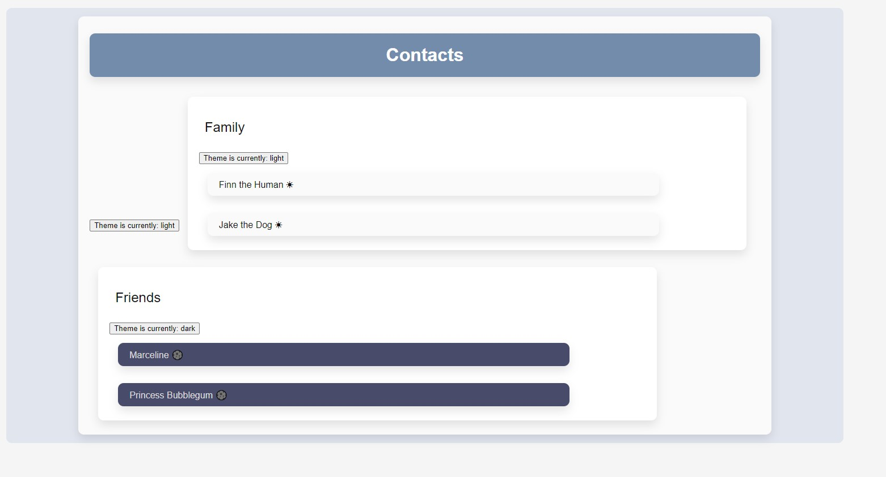

# Theme Switcher

## Table of contents

- [Overview](#overview)
  - [The challenge](#the-challenge)
  - [Screenshot](#screenshot)
  - [Links](#links)
- [My process](#my-process)
  - [Built with](#built-with)
  - [What I learned](#what-i-learned)
  - [Continued development](#continued-development)
- [Author](#author)

## Overview

### The challenge

Users should be able to:

- View the optimal layout for the app depending on their device's screen size
- Change the areas between black and white

### Screenshot

### Links

- Live Site URL: [View](https://themetoggler24.netlify.app/)

## My process

- **Prop drilling** is the term for the common React pattern of data being passed as a prop through a large number of components in an application.
- **Contexts** allow us to avoid prop drilling pieces of application state shared by many components. Contexts come with a `.Provider` component that can also take in a value to be made available to child components – without having to prop drill the value.
- Child components, acting as **Consumers**, may subscribe to a Context’s value from their closest parent **Provider** with React’s `useContext()` hook. Components subscribing to a Context will receive the value for the Provider closest to them in the application tree.
- Providers may be given an object containing the React state and its corresponding state updater function. Subscribing child components may then use the state updater function to update the state for the Context.

### Built with

- Semantic HTML5 markup
- CSS custom properties
- Mobile-Responsive Design
- JavaScript - Scripting language
- [React](https://reactjs.org/) - JS library

### What I learned

This was a class project to learn about context API.

### Continued development

maybe use later

## Author

- Website - [Cameron Howze](https://camkol.github.io/)
- Frontend Mentor - [@camkol](https://www.frontendmentor.io/profile/camkol)
- GitHub- [@camkol](https://github.com/camkol)
- LinkedIn - [@cameron-howze](https://www.linkedin.com/in/cameron-howze-28a646109/)
- E-Mail - [cameronhowze4@outlook.com](mailto:cameronhowze4@outlook.com)
